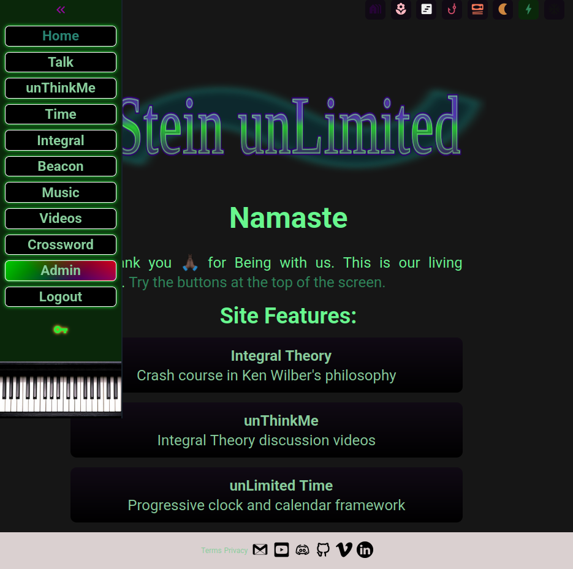

# Stein unLimited

### **A full-stack Vue 3 portfolio site that demonstrates advanced front-end architecture, Firebase integration, and CI/CD workflows.**

---

**This site is a personal showcase and playground for design, engineering, and creative expression — built from the ground up. It also functions as a fully-featured web app with live content, admin tools, and real-time data.**
  

  

---

## 🔧 Features & Tech Stack

- **Vue 3 + TypeScript** — modular, reactive architecture with Pinia store
- **Firebase Auth, Firestore, Storage** — secure, serverless back end
- **Cloud Functions (Node.js)** — server logic for admin + dynamic routes
- **CI/CD with GitHub Actions** — automated deployment + testing
- **End-to-End + Unit Testing** — Playwright and Vitest
- **Responsive SCSS Design System** — custom themes, CSS variables, Sass maps
- **YouTube API Integration** — fetches + syncs latest content
- **Admin Dashboard** — secure tools for content and data management
- **Markdown Blog System** — author-friendly, file-based content
- **Custom Web App Features** — real-time calendar/clock, playable browser game
- **Accessible + Mobile-Friendly UI** — unconventional but usable

#### This is an open source website so feel welcome to help make it cooler. 🫶🏽

  

  
## 🧠 Why I Built This

Always seeking to kill two birds with one stone - this project is my developer sandbox, my multimedia portfolio, my general perspective on things, my alternative toolset... and it's one of the ways I've taught myself to code. Working on artistic stuff keeps it fresh.

This site isn’t just a portfolio — it’s a living full-stack app that helped me:

- Learn advanced Vue 3 patterns
- Deepen my understanding of Firebase services and serverless architecture
- Implement real-world CI/CD pipelines
- Apply TDD and testing best practices with Playwright and Vitest
- Build a scalable design system with custom theming
- Real-life feedback and realtime production troubleshooting

  

---

## 🛠 Developer Setup

#### Requirements:

- Node.js

- Firebase CLI (`npm install -g firebase-tools`)

#### Firebase

Create your own Firebase project with Hosting, Auth, Firestore, and Storage.
Copy .env.example to .env and fill in your Firebase credentials.

⚠️ Admin functions require service account setup. These are not included for security reasons.

#### Installation:

`npm install`

### Local Development:

`npm run dev`       # Start Vite development server  

`npm run build`     # Production build  

`npm run preview`   # Preview production build

### Testing:

`npm run test:unit`   # Run Vitest unit tests

`npm run test:e2e`    # Run Playwright end-to-end tests

`npm run typecheck`   # Validate TypeScript types

`npm run lint`        # Lint with ESLint

---

### 👍🏾 Reach out and let me know what you think! 

### 🔧 Introduce me to your project team